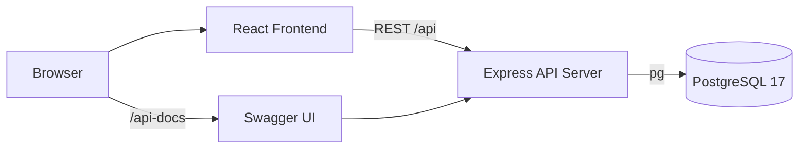
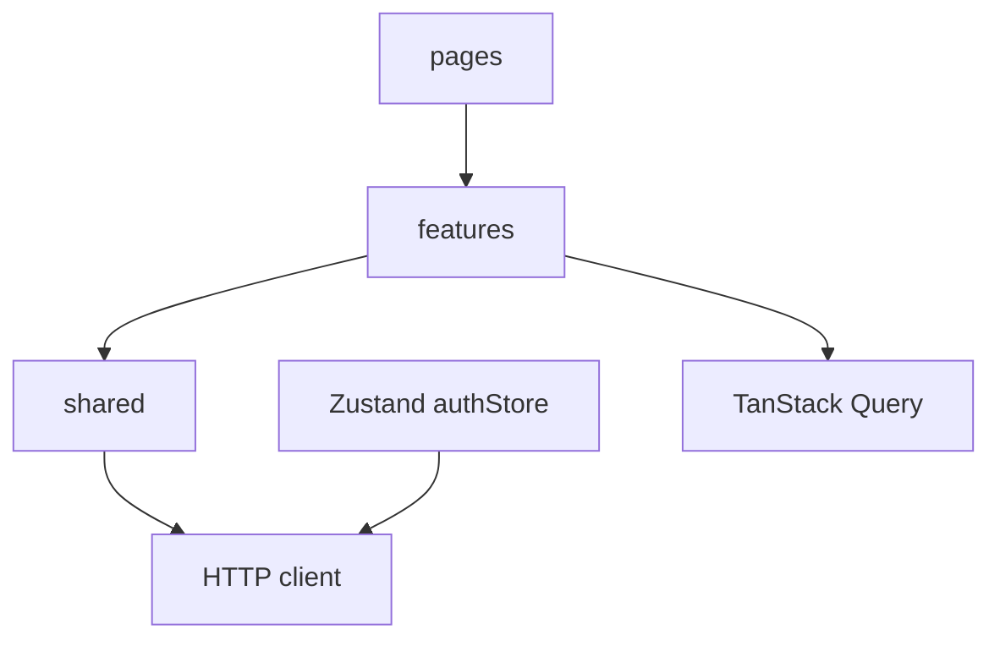
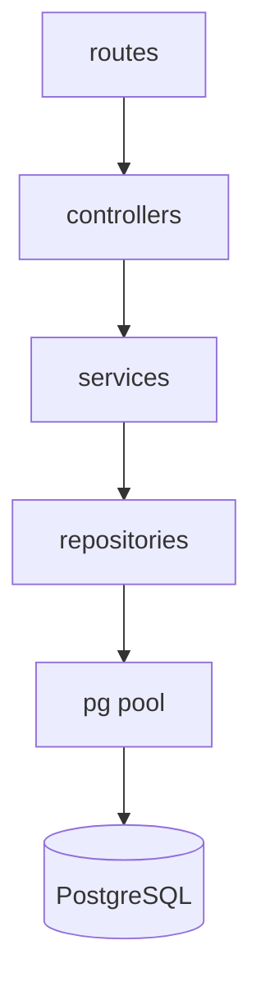
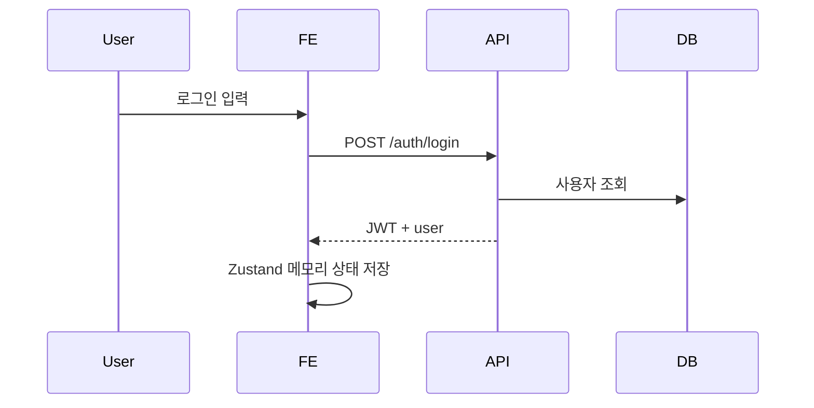
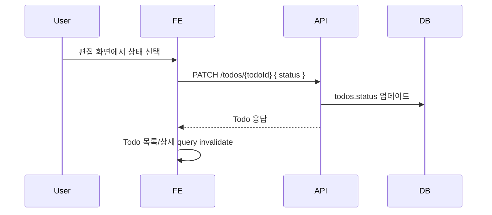
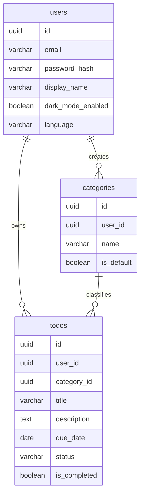

# TodoListApp 아키텍처

## 1. 전체 구조

## 2. 프론트엔드 구조

- `pages`: 라우트 단위 화면
- `features/auth`: 인증, JWT 메모리 상태, 보호 라우트, 다크모드/언어 동기화
- `features/todos`: Todo API, Hook, 필터 store, 목록/폼 컴포넌트
- `features/categories`: 카테고리 API, 생성/선택 컴포넌트, 기본 카테고리 다국어 표시 유틸
- `features/users`: 내 정보 조회/수정, 회원 탈퇴
- `shared`: API client, route/query key 상수, i18n

## 3. 백엔드 구조

- `routes`: Express route binding
- `controllers`: 요청/응답 처리와 주요 로그
- `services`: validation, 권한 확인, 비즈니스 규칙
- `repositories`: SQL 실행
- `db/pool.js`: PostgreSQL connection pool

## 4. 주요 API 모듈

| 모듈 | 책임 | 주요 엔드포인트 |
| --- | --- | --- |
| Auth | 회원가입, 로그인, 로그아웃 | `POST /auth/signup`, `POST /auth/login`, `POST /auth/logout` |
| Users | 내 정보 조회/수정, 탈퇴 | `GET /users/me`, `PATCH /users/me`, `DELETE /users/me` |
| Categories | 카테고리 조회/생성 | `GET /categories`, `POST /categories` |
| Todos | 할일 CRUD, 상태/필터 | `GET /todos`, `POST /todos`, `GET /todos/:id`, `PATCH /todos/:id`, `DELETE /todos/:id` |
| System | Health, Swagger | `GET /health`, `GET /api-docs` |

## 5. 상태 흐름

### 인증

### Todo 상태 변경

## 6. 데이터 요약

