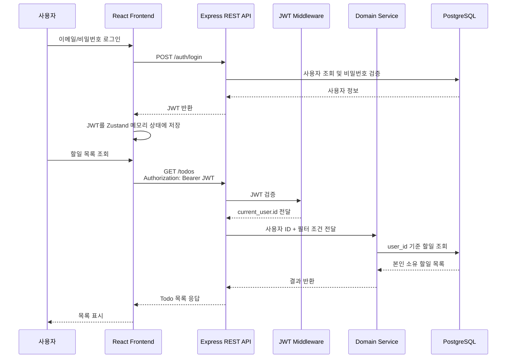
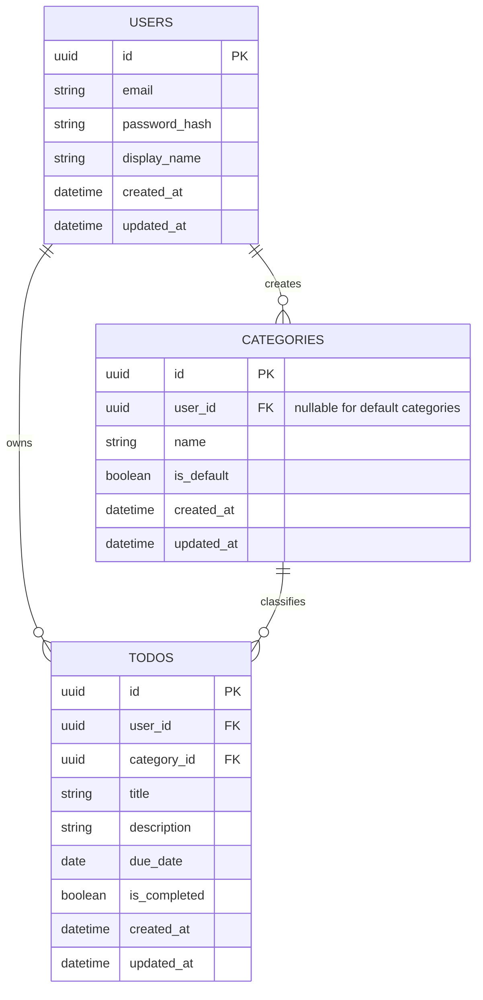

# TodoListApp 기술 아키텍처 다이어그램

본 문서는 `docs/2-prd.md`와 `docs/4-project-principles.md`를 바탕으로 TodoListApp MVP의 기술 아키텍처를 표현한다.

## 아키텍처 개요

TodoListApp은 반응형 웹 UI, Express REST API, PostgreSQL 17 데이터베이스로 구성한다. 프론트엔드는 React 19와 TypeScript를 사용하고, JWT는 Zustand store의 메모리 상태에 저장하며, 서버 상태는 TanStack Query로 관리한다. 백엔드는 Node.js와 Express 기반 REST API를 제공하며, PostgreSQL 연동은 `pg` 라이브러리를 사용한다.

MVP 핵심 도메인은 `auth`, `users`, `todos`, `categories`이다.

## 전체 아키텍처

```mermaid
flowchart LR
    actor[사용자<br/>데스크톱/모바일 브라우저]

    subgraph fe[Frontend - React 19 + TypeScript]
        pages[Pages<br/>Login / Signup / TodoList / TodoForm / Profile]
        features[Feature Modules<br/>auth / users / todos / categories]
        components[UI Components<br/>Form / List / Filter / Dialog]
        zustand[Zustand Store<br/>JWT memory auth state / todo filters / modal state]
        query[TanStack Query<br/>server cache / mutations]
        http[HTTP Client<br/>API base URL / JWT header / error handling]
    end

    subgraph be[Backend - Node.js + Express]
        routes[Routes<br/>/auth /users/me /todos /categories]
        middlewares[Middlewares<br/>JWT auth / validation / error handler]
        controllers[Controllers<br/>request / response mapping]
        services[Services<br/>business rules / ownership / transaction]
        repositories[Repositories<br/>SQL query / row mapping]
        pg[pg<br/>PostgreSQL driver]
    end

    subgraph db[PostgreSQL 17]
        users[(users)]
        todos[(todos)]
        categories[(categories)]
    end

    actor --> pages
    pages --> components
    pages --> features
    features --> zustand
    features --> query
    query --> http
    http -->|REST API + JWT| routes

    routes --> middlewares
    middlewares --> controllers
    controllers --> services
    services --> repositories
    repositories --> pg
    pg --> users
    pg --> todos
    pg --> categories

    todos -->|user_id| users
    todos -->|category_id| categories
    categories -->|user_id nullable| users
```

## 인증 및 보호 API 흐름

## 도메인 모듈 책임

| 모듈 | 주요 책임 | 주요 API |
| --- | --- | --- |
| `auth` | 회원가입, 로그인, 로그아웃, JWT 발급 | `POST /auth/signup`, `POST /auth/login`, `POST /auth/logout` |
| `users` | 내 정보 조회, 이름/닉네임 수정, 회원 탈퇴 | `GET /users/me`, `PATCH /users/me`, `DELETE /users/me` |
| `todos` | 할일 CRUD, 완료 여부 변경, 필터링 | `GET /todos`, `POST /todos`, `GET /todos/:id`, `PATCH /todos/:id`, `DELETE /todos/:id` |
| `categories` | 기본 카테고리 조회, 사용자 추가 카테고리 생성 | `GET /categories`, `POST /categories` |

## 데이터 저장 구조

## 핵심 설계 규칙

- 보호 API는 JWT 인증 미들웨어를 반드시 통과한다.
- JWT는 프론트엔드의 Zustand store 메모리 상태에만 저장한다.
- JWT는 `localStorage` 또는 `sessionStorage`에 저장하지 않는다.
- Todo 조회, 수정, 삭제는 항상 `user_id` 조건으로 본인 소유 데이터만 처리한다.
- 기본 카테고리는 `user_id = null`, `is_default = true`로 관리한다.
- 사용자 추가 카테고리는 생성 사용자 ID를 가진다.
- 회원 탈퇴는 사용자, 본인 소유 할일, 사용자 추가 카테고리를 트랜잭션으로 삭제한다.
- 로그아웃은 MVP 기준으로 Zustand store의 JWT 삭제 방식으로 처리한다.
- 서버 측 JWT 블랙리스트는 MVP 범위에서 제외한다.
- SQL 실행은 `pg`와 파라미터 바인딩을 사용한다.
