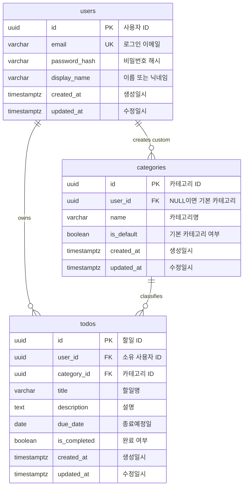

# TodoListApp ERD

본 문서는 `docs/2-prd.md`의 MVP 데이터 요구사항을 바탕으로 작성한 PostgreSQL 17 기준 ERD이다.

JWT는 프론트엔드의 Zustand store 메모리 상태에 저장하므로 DB 테이블로 관리하지 않는다.

## ERD



## 테이블 설명

### users

인증 사용자를 저장한다. 이메일은 로그인 식별자로 사용하며 중복될 수 없다. 비밀번호는 평문이 아니라 해시로 저장한다.

### categories

할일 분류 기준을 저장한다. 기본 카테고리와 사용자 추가 카테고리를 하나의 테이블에서 관리한다.

- 기본 카테고리: `user_id = null`, `is_default = true`
- 사용자 추가 카테고리: `user_id = 생성 사용자 ID`, `is_default = false`
- MVP 기본 카테고리: `일반`, `업무`, `개인`, `학습`

### todos

사용자의 할일을 저장한다. 모든 할일은 특정 사용자에게 귀속되며 하나의 카테고리에 속한다.

## 관계 및 삭제 정책

- `users` 1:N `todos`
- `users` 1:N `categories`
- `categories` 1:N `todos`
- 회원 탈퇴 시 해당 사용자의 `todos`와 사용자 추가 `categories`는 즉시 삭제한다.
- 기본 카테고리는 전역 데이터이므로 회원 탈퇴 시 삭제되지 않는다.

## 권장 제약 조건

- `users.email`: `UNIQUE NOT NULL`
- `users.password_hash`: `NOT NULL`
- `users.display_name`: `NOT NULL`
- `categories.name`: `NOT NULL`
- `categories.is_default`: `NOT NULL DEFAULT false`
- `todos.user_id`: `users.id` 참조, `ON DELETE CASCADE`
- `categories.user_id`: `users.id` 참조, `ON DELETE CASCADE`
- `todos.category_id`: `categories.id` 참조
- `todos.title`: `NOT NULL`
- `todos.category_id`: `NOT NULL`
- `todos.is_completed`: `NOT NULL DEFAULT false`
- `categories` 기본/사용자 카테고리 구분:

```sql
CHECK (
  (is_default = true AND user_id IS NULL)
  OR
  (is_default = false AND user_id IS NOT NULL)
)
```

## 권장 인덱스

- `users(email)`
- `todos(user_id)`
- `todos(user_id, due_date)`
- `todos(user_id, category_id)`
- `todos(user_id, is_completed)`
- `categories(user_id)`
- 기본 카테고리명 중복 방지: `UNIQUE (name) WHERE is_default = true`
- 사용자별 카테고리명 중복 방지: `UNIQUE (user_id, name) WHERE is_default = false`
