# TodoListApp Use Case Diagram

본 문서는 `docs/2-prd.md`의 MVP 1차 릴리즈 범위를 기준으로 작성한 유스케이스 다이어그램이다.

```mermaid
flowchart LR
    guest[비회원 사용자]
    user[인증 사용자]
    system[시스템]

    subgraph app[TodoListApp]
        uc_signup((회원가입))
        uc_login((로그인))
        uc_logout((로그아웃))
        uc_verify_jwt((JWT 검증))

        uc_view_profile((내 정보 조회))
        uc_update_profile((내 정보 수정))
        uc_delete_account((회원 탈퇴))
        uc_delete_data((사용자 데이터 즉시 삭제))

        uc_create_todo((할일 등록))
        uc_list_todo((할일 목록 조회))
        uc_view_todo((할일 상세 조회))
        uc_update_todo((할일 수정))
        uc_delete_todo((할일 삭제))
        uc_toggle_todo((완료 여부 변경))

        uc_list_category((카테고리 조회))
        uc_create_category((사용자 카테고리 생성))
        uc_default_category((기본 카테고리 제공))

        uc_filter_category((카테고리별 필터링))
        uc_filter_due_date((종료예정일 기간 필터링))
        uc_filter_done((완료 여부 필터링))
        uc_filter_combined((복합 조건 필터링))

        uc_access_control((사용자별 데이터 접근 제한))
    end

    guest --> uc_signup
    guest --> uc_login

    user --> uc_logout
    user --> uc_view_profile
    user --> uc_update_profile
    user --> uc_delete_account
    user --> uc_create_todo
    user --> uc_list_todo
    user --> uc_view_todo
    user --> uc_update_todo
    user --> uc_delete_todo
    user --> uc_toggle_todo
    user --> uc_list_category
    user --> uc_create_category
    user --> uc_filter_category
    user --> uc_filter_due_date
    user --> uc_filter_done
    user --> uc_filter_combined

    system --> uc_verify_jwt
    system --> uc_default_category
    system --> uc_access_control
    system --> uc_delete_data

    uc_login -.include.-> uc_verify_jwt
    uc_view_profile -.include.-> uc_verify_jwt
    uc_update_profile -.include.-> uc_verify_jwt
    uc_delete_account -.include.-> uc_verify_jwt
    uc_create_todo -.include.-> uc_verify_jwt
    uc_list_todo -.include.-> uc_verify_jwt
    uc_view_todo -.include.-> uc_verify_jwt
    uc_update_todo -.include.-> uc_verify_jwt
    uc_delete_todo -.include.-> uc_verify_jwt
    uc_toggle_todo -.include.-> uc_verify_jwt
    uc_list_category -.include.-> uc_verify_jwt
    uc_create_category -.include.-> uc_verify_jwt

    uc_view_profile -.include.-> uc_access_control
    uc_update_profile -.include.-> uc_access_control
    uc_create_todo -.include.-> uc_access_control
    uc_list_todo -.include.-> uc_access_control
    uc_view_todo -.include.-> uc_access_control
    uc_update_todo -.include.-> uc_access_control
    uc_delete_todo -.include.-> uc_access_control
    uc_toggle_todo -.include.-> uc_access_control
    uc_create_category -.include.-> uc_access_control

    uc_delete_account -.include.-> uc_delete_data
    uc_list_category -.include.-> uc_default_category
    uc_list_todo -.extend.-> uc_filter_category
    uc_list_todo -.extend.-> uc_filter_due_date
    uc_list_todo -.extend.-> uc_filter_done
    uc_list_todo -.extend.-> uc_filter_combined
```

## 액터

- 비회원 사용자: 회원가입과 로그인을 수행한다.
- 인증 사용자: Zustand store의 메모리 상태에 저장된 JWT로 본인 정보, 할일, 카테고리, 필터링 기능을 사용한다.
- 시스템: JWT 검증, 기본 카테고리 제공, 사용자별 데이터 접근 제한, 탈퇴 시 데이터 삭제를 수행한다.

## 범위

- 포함: PRD MVP 1차 릴리즈 기능
- 제외: OAuth Social 인증, 다크 모드, 다국어 지원, 협업 기능, 반복 일정, 알림, 파일 첨부, 외부 캘린더 연동, 관리자 기능
